# 2. Use Case Diagram

몇 가지 예를 들어봅시다.

## 2.1. Usecases

Use case는 소괄호`()`로 둘러싸서 표현할 수 있습니다. (소괄호로 둘러싸면 타원처럼 보이기 때문)

Use case를 정의하기 위해 `usecase` 키워드를 사용할 수도 있습니다.

`as` 키워드를 사용하면 별명을 붙일 수 있으며, 관계를 정의할 때 이 별명을 사용할 수 있습니다.

```text
@startuml
    (First usecase)
    (Another usecase) as (UC2)
    usecase UC3
    usecase (Last\nusecase) as UC4
@enduml
```

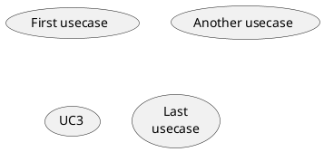

## 2.2. Actors

Actor는 콜론`:`으로 둘러싸서 표현할 수 있습니다.

Actor를 정의하기 위해 `actor` 키워드를 사용할 수도 있습니다.

`as` 키워드를 사용하면 별명을 붙일 수 있으며, 관계를 정의할 때 이 별명을 사용할 수 있습니다.

```text
@startuml
    :First Actor:
    :Another\nactor: as Man2
    actor Woman3
    actor :Last actor: as Person1
@enduml
```

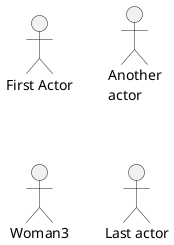

## 2.3. Actor 스타일 변경하기

Actor의 스타일은 기본적으로 스틱맨(stick man) 형태지만, `skinparam` 명령을 이용해 스타일을 변경할 수 있습니다.

- 어썸맨(awesome man): `skinparam actorStyle awesome`
- 할로우맨(hollow): `skinparam actorStyle hollow`

### 2.3.1. 스틱맨 (기본값)

```text
@startuml
    :User: --> (Use)
    "Main Admin" as Admin
    "Use the application" as (Use)
    Admin --> (Admin the application)
@enduml
```

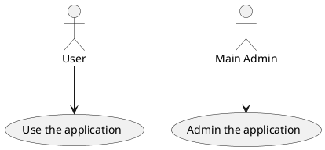

### 2.3.2. 어썸맨

```text
@startuml
    :User: --> (Use)
    "Main Admin" as Admin
    "Use the application" as (Use)
    Admin --> (Admin the application)
@enduml
```

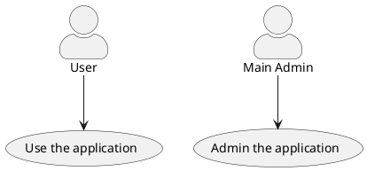

### 2.3.3. 할로우맨

```text
@startuml
    :User: --> (Use)
    "Main Admin" as Admin
    "Use the application" as (Use)
    Admin --> (Admin the application)
@enduml
```

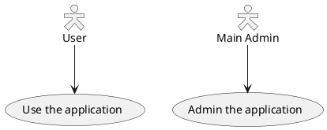

## 2.4. Usecase 설명

Usecase를 설명을 여러 줄에 걸쳐 작성하려면 따옴표`""`를 사용합니다.

문장을 나누기 위해 다음과 같은 구분자를 사용할 수 있습니다.

- -- (dashes)
- .. (periods)
- == (equals)
- __ (underscores)

구분자를 두개 입력 후, 문장을 둘러싸면 제목을 표현할 수 있습니다.

```text
@startuml
    usecase UC1 as "You can use
    several lines to define your usecase.
    You can also use separators.
    --
    Several separators are possible.
    ==
    And you can add titles:
    ..Conclusion..
    This allows large description."
@enduml
```

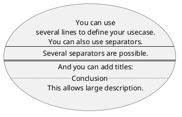

## 2.5. package 사용하기

`actor`나 `usecase`를 그룹짓기 위해 `package`를 사용할 수 있습니다.

```text
@startuml
    left to right direction
    actor Guest as g
    package Professional {
        actor Chef as c
        actor "Food Critic" as fc
    }
    package Restaurant {
        usecase "Eat Food" as UC1
        usecase "Pay for Food" as UC2
        usecase "Drink" as UC3
        usecase "Review" as UC4
    }
    fc --> UC4
    g --> UC1
    g --> UC2
    g --> UC3
@enduml
```

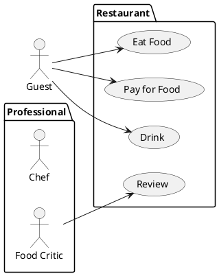

`package`대신 `rectangle`을 사용할 수도 있습니다.

```text
@startuml
    left to right direction
    actor "Food Critic" as fc
    rectangle Restaurant {
        usecase "Eat Food" as UC1
        usecase "Pay for Food" as UC2
        usecase "Drink" as UC3
    }
    fc --> UC1
    fc --> UC2
    fc --> UC3
@enduml
```

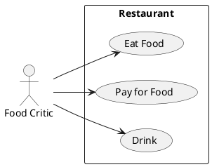

## 2.6. 기본 예제

`actor`나 `usecase`를 연결하기 위해 화살표`-->`를 사용합니다.

 대시`-`의 개수를 늘리면 화살표가 길어집니다.

 화살표 뒤에 레이블(label)을 붙이려면, 연결 후 콜론`:` 과 문장을 입력합니다.

```text
@startuml
    User -> (Start)
    User --> (Use the application) : A small label
    :Main Admin: ---> (Use the application) : This is\nyet another\nlabel
@enduml
```

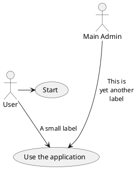

## 2.7. 상속(extension)의 표현

하나의 actor나 usecase가 다른 것을 상속받는다면 `<|--` 기호를 사용합니다.

```text
@startuml
    :Main Admin: as Admin
    (Use the application) as (Use)
    User <|-- Admin
    (Start) <|-- (Use)
@enduml
```

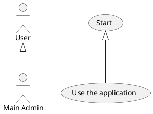

## 2.8. 노트(notes) 사용하기

특정 객체에 대한 노트를 정의하기 위해 `note left of`, `note right of`, `note top of`, `note bottom of` 키워드를 사용할 수 있습니다.

`note` 키워드를 이용해 노트 자체만 정의할 수도 있는데, 이렇게 생성한 노트를 객체와 연결하려면 `..` 기호를 사용합니다.

```text
@startuml
    :Main Admin: as Admin
    (Use the application) as (Use)
    User -> (Start)
    User --> (Use)
    Admin ---> (Use)
    note right of Admin : This is an example.
    note right of (Use)
    A note can also
    be on several lines
    end note
    note "This note is connected\nto several objects." as N2
    (Start) .. N2
    N2 .. (Use)
@enduml
```

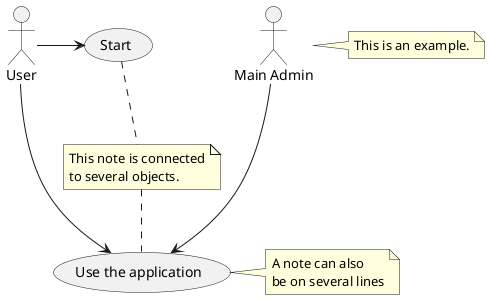

## 2.9. 스테레오타입(stereotypes)

`actor`와 `usecase`를 정의할 때 `<<`와 `>>` 기호를 이용해 스테레오타입을 추가할 수 있습니다.

```text
@startuml
    User << Human >>
    :Main Database: as MySql << Application >>
    (Start) << One Shot >>
    (Use the application) as (Use) << Main >>
    User -> (Start)
    User --> (Use)
    MySql --> (Use)
@enduml
```

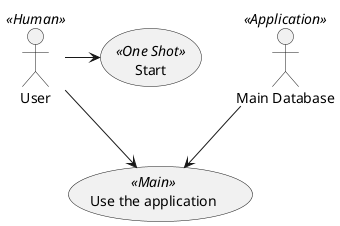

## 2.10. 화살표 방향 바꾸기

두 개의 대시`--`를 사용해 클래스를 연결하면 보통 세로로 정렬됩니다.

만일 가로로 정렬하고 싶다면, 대시`-`나 점`.`를 하나만 사용합니다.

```text
@startuml
    :user: --> (Use case 1)
    :user: -> (Use case 2)
@enduml
```

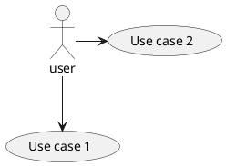

연결을 뒤집어서 방향을 변경할 수도 있습니다.

```text
@startuml
    (Use case 1) <.. :user:
    (Use case 2) <- :user:
@enduml
```

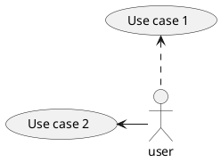

화살표 사이에 `left`, `right`, `up`, `down` 키워드를 추가하여 화살표의 방향을 변경할 수도 있습니다.

```text
@startuml
    :user: -left-> (dummyLeft)
    :user: -right-> (dummyRight)
    :user: -up-> (dummyUp)
    :user: -down-> (dummyDown)
@enduml
```

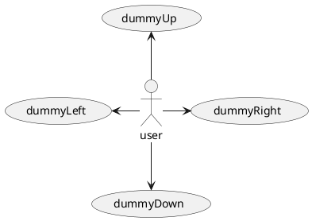

방향을 표현할 때, 앞의 한 글자 또는 두 글자만 사용할 수도 있습니다.

예를 들어 `-down-` 대신 `-d-`나 `-do-`를 사용해도 동일한 결과를 얻을 수 있습니다.

하지만 이 기능을 남용하면 올바르지 않은 결과를 얻을 수도 있으니, 가급적 전체 단어를 사용하는 것이 좋습니다.

`left to right direction` 명령을 사용하면 상하좌우가 반시계 방향으로 90도 회전합니다.

```text
@startuml
    left to right direction
    :user: -left-> (dummyLeft)
    :user: -right-> (dummyRight)
    :user: -up-> (dummyUp)
    :user: -down-> (dummyDown)
@enduml
```

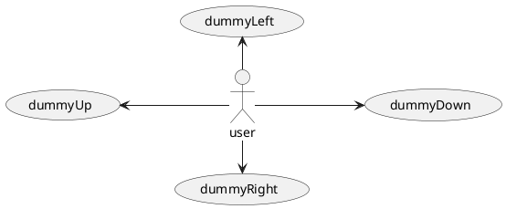

## 2.11. 다이어그램 분리

`newpage` 키워드를 사용하면 다이어그램을 여러 페이지 또는 여러 이미지로 분리할 수 있습니다.

```text
@startuml
    :actor1: --> (Usecase1)
    newpage
    :actor2: --> (Usecase2)
@enduml
```

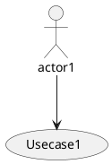

## 2.12. 왼쪽에서 오른쪽 방향으로 표현하기

다이어그램을 표현할 때는 보통 위에서 아래 방향으로 만들어집니다.

```text
@startuml
    'default
    top to bottom direction
    user1 --> (Usecase 1)
    user2 --> (Usecase 2)
@enduml
```

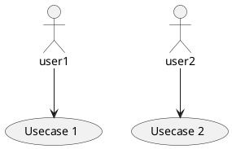

`left to right direction` 명령을 사용하면 다이어그램을 왼쪽에서 오른쪽 방향으로 만들 수 있습니다.

```text
@startuml
    left to right direction
    user1 --> (Usecase 1)
    user2 --> (Usecase 2)
@enduml
```

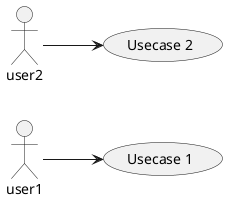

## 2.13. 스킨 파라미터(skinparam)

그림의 색상이나 폰트를 변경하려면 `skinparam` 명령을 사용할 수 있습니다.

`skinparam` 명령을 사용할 수 있는 곳은 다음과 같습니다.

- 다이어그램 정의 구문
- include한 파일
- 커맨드라인이나 ANT task를 통해 전달받은 설정 파일

`stereotype`으로 표현한 `actor`나 `usecase`에 특별한 색상이나 폰트를 적용할 수도 있습니다.

```text
@startuml
    skinparam handwritten true
    skinparam usecase {
        BackgroundColor DarkSeaGreen
        BorderColor DarkSlateGray
        BackgroundColor<< Main >> YellowGreen
        BorderColor<< Main >> YellowGreen
        ArrowColor Olive
        ActorBorderColor black
        ActorFontName Courier
        ActorBackgroundColor<< Human >> Gold
    }
    User << Human >>
    :Main Database: as MySql << Application >>
    (Start) << One Shot >>
    (Use the application) as (Use) << Main >>
    User -> (Start)
    User --> (Use)
    MySql --> (Use)
@enduml
```

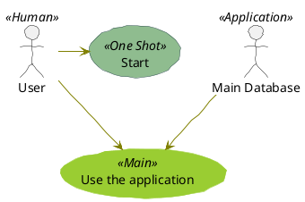

## 2.14. 온전한 예제

```text
@startuml
    left to right direction
    skinparam packageStyle rectangle
    actor customer
    actor clerk
    rectangle checkout {
        customer -- (checkout)
        (checkout) .> (payment) : include
        (help) .> (checkout) : extends
        (checkout) -- clerk
    }
@enduml
```

```plantuml
@startuml
    left to right direction
    skinparam packageStyle rectangle
    actor customer
    actor clerk
    rectangle checkout {
        customer -- (checkout)
        (checkout) .> (payment) : include
        (help) .> (checkout) : extends
        (checkout) -- clerk
    }
@enduml
```

## 2.15. Business usecase

Business usecase를 표현하기 위해 `/` 기호를 사용할 수 있습니다.

### 2.15.1. Business Usecase

```text
@startuml
    (First usecase)/
    (Another usecase)/ as (UC2)
    usecase/ UC3
    usecase/ (Last\nusecase) as UC4
@enduml
```

```plantuml
@startuml
    (First usecase)/
    (Another usecase)/ as (UC2)
    usecase/ UC3
    usecase/ (Last\nusecase) as UC4
@enduml
```

### 2.15.2. Business Actor

```text
@startuml
    :First Actor:/
    :Another\nactor:/ as Man2
    actor/ Woman3
    actor/ :Last actor: as Person1
@enduml
```

```plantuml
@startuml
    :First Actor:/
    :Another\nactor:/ as Man2
    actor/ Woman3
    actor/ :Last actor: as Person1
@enduml
```

[Ref. *QA-12179*]

## 2.16. 화살표 색상과 스타일 변경하기 (inline style)

화살표의 색상과 스타일을 개별적으로 변경하기 위해 아래와 같은 표현을 사용할 수 있습니다.

- `#color;line.[bold|dashed|dotted];text:color`

```text
@startuml
    actor foo
    foo --> (bar) : normal
    foo --> (bar1) #line:red;line.bold;text:red : red bold
    foo --> (bar2) #green;line.dashed;text:green : green dashed
    foo --> (bar3) #blue;line.dotted;text:blue : blue dotted
@enduml
```

```plantuml
@startuml
    actor foo
    foo --> (bar) : normal
    foo --> (bar1) #line:red;line.bold;text:red : red bold
    foo --> (bar2) #green;line.dashed;text:green : green dashed
    foo --> (bar3) #blue;line.dotted;text:blue : blue dotted
@enduml
```

[Ref. *QA-3770* and *QA-3816*] [*See similar feature on deployment-diagram or class diagram*]

## 2.17. 요소(element)의 색상과 스타일 변경하기 (inline style)

요소의 색상과 스타일을 개별적으로 변경하기 위해 아래와 같은 표현을 사용할 수 있습니다.

- `#[color|back:color];line:color;line.[bold|dashed|dotted];text:color`

```text
@startuml
    actor a
    actor b #pink;line:red;line.bold;text:red
    usecase c #palegreen;line:green;line.dashed;text:green
    usecase d #aliceblue;line:blue;line.dotted;text:blue
@enduml
```

```plantuml
@startuml
    actor a
    actor b #pink;line:red;line.bold;text:red
    usecase c #palegreen;line:green;line.dashed;text:green
    usecase d #aliceblue;line:blue;line.dotted;text:blue
@enduml
```

[Ref. *QA-5340* and adapted from *QA-6852*]
